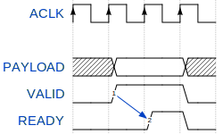
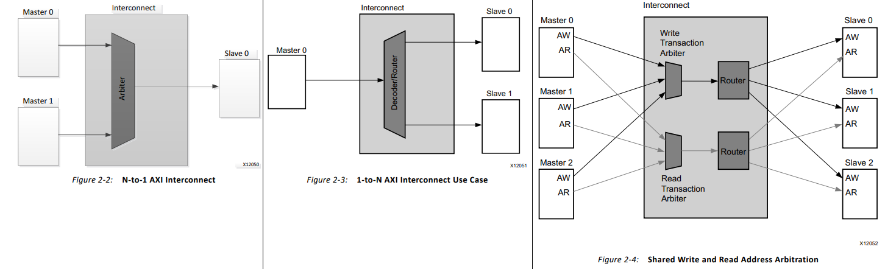
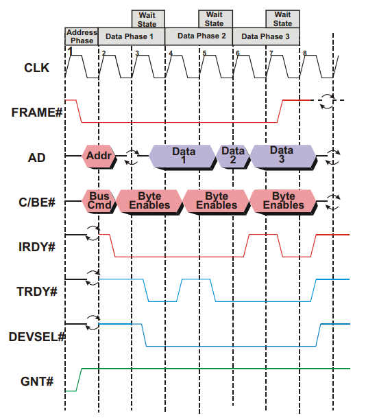

### AXI

AXI 握手协议

**AXI4的5个通道**

- Write Address channel (AW)：提供数据写入的地址
  - 还可以指定突发大小（AWSIZE）、每次突发的节拍（AWLEN + 1）、突发类型（AWBURST）等
  - AWVALID（主机到从机）和 AWREADY（从机到主机）
- Write Data channel (W):实际的数据写入
  - 还可以指定数据和节拍ID
  - 发送方在完成时总会声明传输已完成（WLAST）
  - WVALID（从机到主机）和 WREADY（主机到从机）
- Write Response channel (B)：写状态
  - BVALID（从机到主机）和 BREADY（主机到从机）
- Read Address channel (AR):提供读地址
  - 还可以指定突发大小（AWSIZE）、每次突发的节拍（AWLEN + 1）、突发类型（AWBURST）等
  - ARVALID（主机到从机）和 ARREADY（从机到主机）
- Read Data channel (R):实际的读数据
  - 还可以发回状态（RRESP）、数据ID等
  - 发送方在完成时总会声明传输已完成（RLAST）
  - RVALID（从机到主机）和 RREADY（主机到从机）

**example**

- 写入时，主设备首先提供写入地址 (0x0) 以及数据规范（4 个节拍4个字节，数据类型为 INCR）。然后，主设备和从设备都会进行握手验证。
- 然后，主设备准备并写入实际的数据有效载荷，并通过通道发送（0x10、0x11、0x12 和 0x13），同样使用握手来验证传输。主设备将使用 WLAST 向从设备发出有效载荷结束的信号。
- 从设备响应写入状态以及写入是否成功或失败（在本例中为 OKAY），并通过另一次握手完成整个事务

- 要读取数据，主设备首先提供读取的起始地址 (0x0)，以及数据规范（4 个节拍， 4 个字节，数据类型为 INCR）。
- 然后，从设备提供实际的数据有效载荷以及每个节拍的状态（所有节拍均正常）。从设备将使用 RLAST 向主设备发出有效载荷结束的信号。我们可以看到，写入指定地址的内容与读回的内容相同。

**AXI 互连与 SmartConnect**

互连 IP 由仲裁器、解码器/路由器、多路复用器和其他逻辑元件组合而成，可无缝适应任何 AXI 系统，无论是连接到一个从机的多主系统、连接到一个主系统的多从系统，还是连接到多个从机的多个主系统（每个最多 16 个）。

### Legacy PCI and PCI Express

作为组件总线（总线本质上是多个组件之间的通信），所有 PCI 概念都围绕维护和处理外设与处理器（CPU）之间的事务。

传统 PCI 是同步的，所有事件都发生在计算机内部时钟的边缘。设备会开始数据事务并指定起始内存地址，这需要一个时钟周期。发送数据本身需要多个周期，直到事务完成，此时连接结束。

（# 表示低电平有效）

- CLK 边缘 1 - FRAME#（总线访问）和 IRDY#（启动器准备好数据）处于非活动状态，因此 PCI 总线处于空闲状态
  - GNT# 处于活动状态，表明总线仲裁器已选择该设备作为下一个发起者/总线主控器
- CLK 边沿 2 - FRAME# 由发起者断言，表示新事务已开始
  - 发起者驱动事务的地址和命令，总线上的其他设备将解码地址以确定它们是否被请求
- CLK 边沿 3 - 发起方通过将 IRDY# 置为低电平有效来表明它已准备好进行数据传输
  - AD 总线上的箭头表示，随着信号所有权的变化，总线正在经历周转周期（启动器驱动地址，但也读取相同引脚上的数据）
  - TRDY# 不会在 AD 变化的同一边沿被驱动为低电平，以避免两个缓冲器同时尝试驱动信号，从而导致共享信号损坏
- CLK 边沿 4 - 总线上的设备已识别请求的地址，并已断言 DEVSEL#（设备选择）以继续进行事务
  - 还断言 TRDY#（目标就绪）以将读取数据的第一部分驱动到 AD 总线上
  - 由于 IRDY# 和 TRDY# 同时处于活动状态，因此数据在该时钟边沿开始传输
  - 发起方知道最终将传输多少字节，但目标方不知道，因此目标方必须检查 FRAME# 以查看它是否仍然有效（完成后将变为非活动状态）
- CLK 边沿 5 - 目标尚未准备好传送下一组数据，因此它会在一个时钟周期内取消 TRDY# 的置位并进入等待状态
- CLK 边沿 6 - 第二个数据项被传输，由于 FRAME# 仍然有效，因此目标知道发起方仍在请求更多数据
- CLK Edge 7 - 发起方强制进入等待状态，允许设备暂停事务并快速填充或清空缓冲区，而无需停止请求
  - 通常效率很低，因为它们既会拖延当前事务，又会阻止其他设备访问总线。
- CLK 边沿 8 - 第三个数据集传输完毕，FRAME# 信号置低，传输结束。在 CLK 边沿 9，所有控制线关闭，总线再次变为空闲状态。
